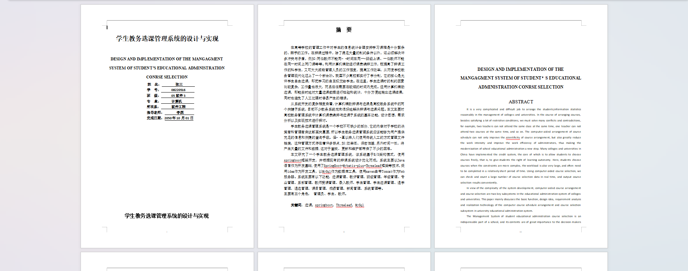
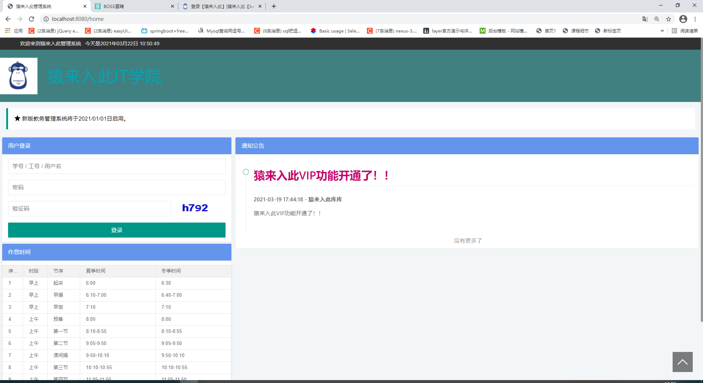
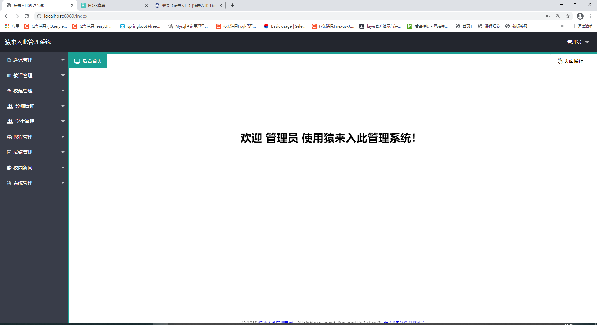
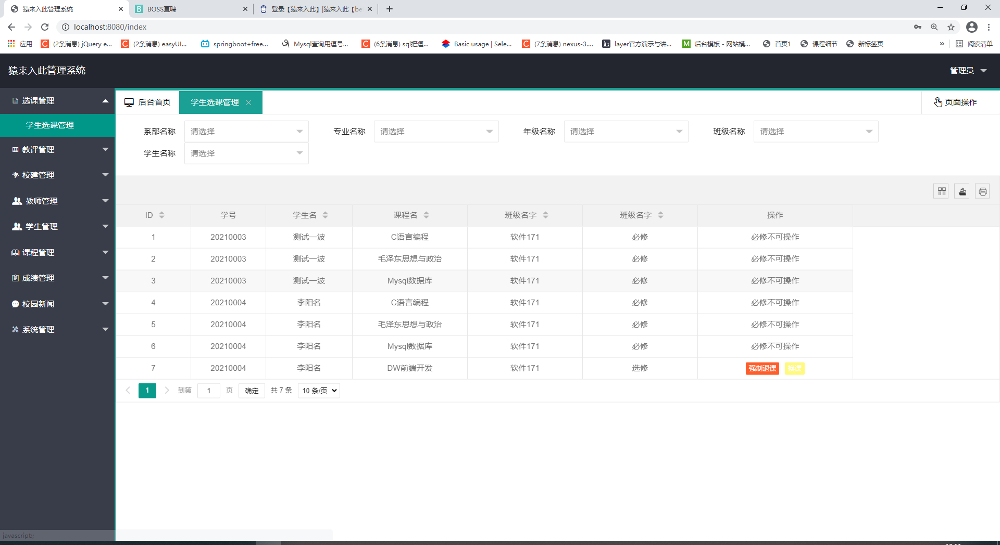
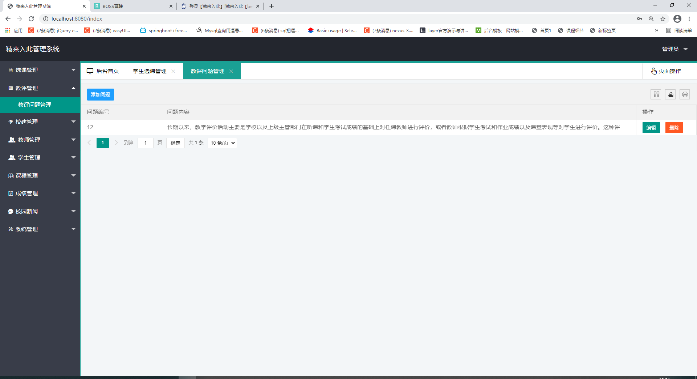
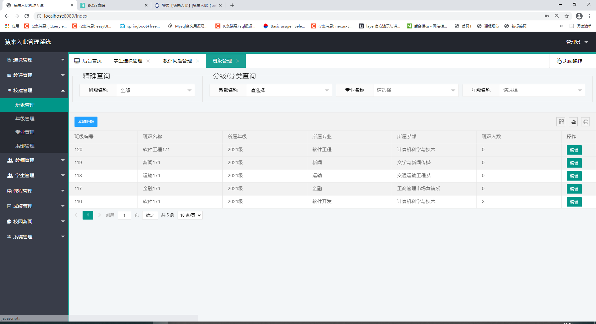
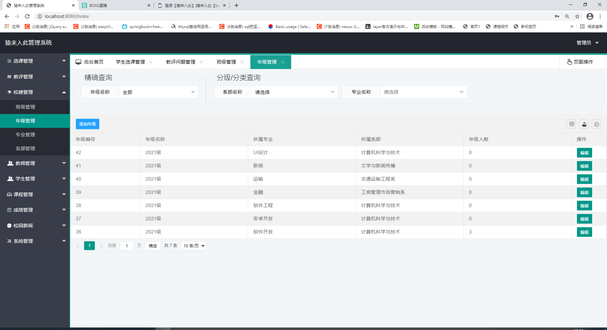

基于Springboot的学生选课管理系统（程序+论文）
=
### 完整代码获取地址：从戎源码网 ([https://armycodes.com/](https://armycodes.com/))
### 作者微信：19941326836  QQ：952045282 
### 承接计算机毕业设计、Java毕业设计、Python毕业设计、深度学习、机器学习
### 选题+开题报告+任务书+程序定制+安装调试+论文+答辩ppt 一条龙服务
### 所有选题地址https://github.com/nature924/allProject

一、项目介绍
---
基于Springboot框架实现的学生选课管理系统包含一种角色：管理员,系统分为前台登录和后台两大模块，主要功能如下。

### 【前台登录】：
1. 学生登录：学生可以通过学号和密码登录系统，查看自己的选课情况、成绩等信息。
2. 教师登录：教师可以通过工号和密码登录系统，查看自己的教授课程、学生评价等信息。

### 【后台模块】：
1. 选课管理：管理员可以管理课程信息，包括添加、编辑、删除课程信息，设置课程容量，调整课程时间表等。
2. 教评管理：管理员可以管理学生对教师的评价，包括查看评价结果、编辑评价内容等。
3. 教评问题管理：管理员可以管理教评中的问题，包括添加、编辑、删除问题，设置问题选项等。
4. 校建管理：管理员可以管理校园建筑信息，包括添加、编辑、删除校建信息，查看校园地图等。
5. 教师管理：管理员可以管理教师信息，包括添加、编辑、删除教师信息，查看教师评价等。
6. 学生管理：管理员可以管理学生信息，包括添加、编辑、删除学生信息，查看学生选课情况等。
7. 课程管理：管理员可以管理课程信息，包括添加、编辑、删除课程信息，查看课程详情等。
8. 成绩管理：管理员可以管理学生成绩，包括录入、编辑、删除成绩，查看学生成绩单等。
9. 校园新闻：管理员可以发布校园新闻，包括添加、编辑、删除新闻，查看新闻详情等。
10. 系统管理：管理员可以管理系统的用户账号和权限，包括添加、编辑、删除用户，设置用户权限等。

二、项目技术
---
- 编程语言：Java
- 数据库：MySQL
- 项目管理工具：Maven
- 前端技术：VUE、HTML、Jquery、Bootstrap
- 后端技术：Spring、SpringMVC、MyBatis

三、运行环境
---
- 操作系统：Windows、macOS都可以
- JDK版本：JDK1.8以上都可以
- 开发工具：IDEA、Ecplise、Myecplise都可以
- 数据库: MySQL5.7以上都可以
- Tomcat：任意版本都可以
- Maven：任意版本都可以

四、运行截图
---
### 论文截图：

### 程序截图：

